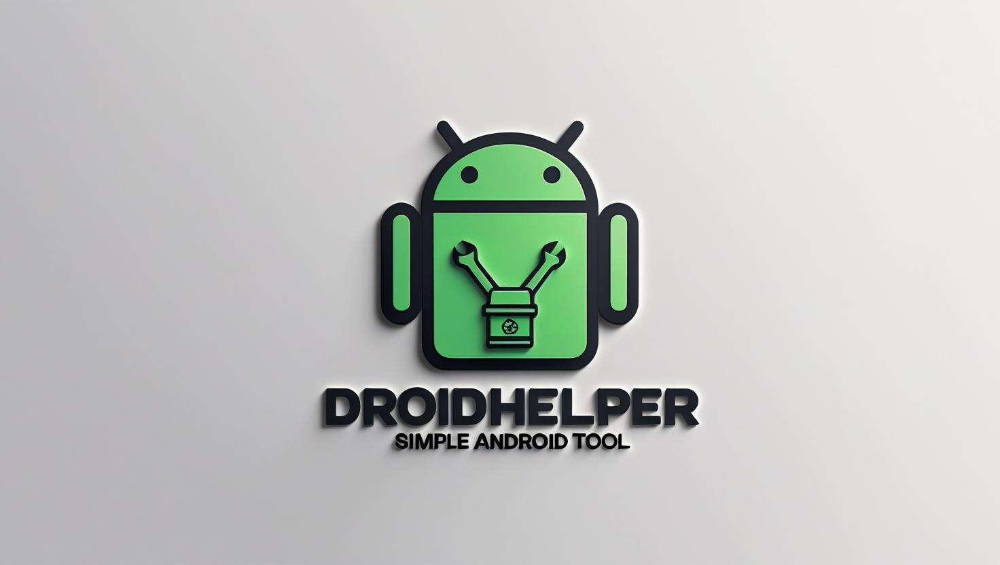

<p align="center">
  
</p>
# 📱 DroidHelper

أداة بسيطة للتحكم في أجهزة أندرويد باستخدام ADB  
Simple tool to interact with Android devices via ADB

---


---

## ✨ Features / المميزات

- عرض معلومات نظام أندرويد
- استخراج مسار التطبيق من اسم الحزمة
- تشغيل التطبيقات عن بُعد
- قراءة سجل Logcat

---

## 📦 Usage / الاستخدام
## 📜 License | الترخيص

This project is licensed under the MIT License – see the [LICENSE](./LICENSE) file for details.  
هذا المشروع مرخّص بموجب رخصة MIT – راجع ملف [LICENSE](./LICENSE) لمزيد من التفاصيل.

1. تأكد من تثبيت ADB على الجهاز
2. شغل السكربت بـ Python:

```bash
python DroidHelper.py

